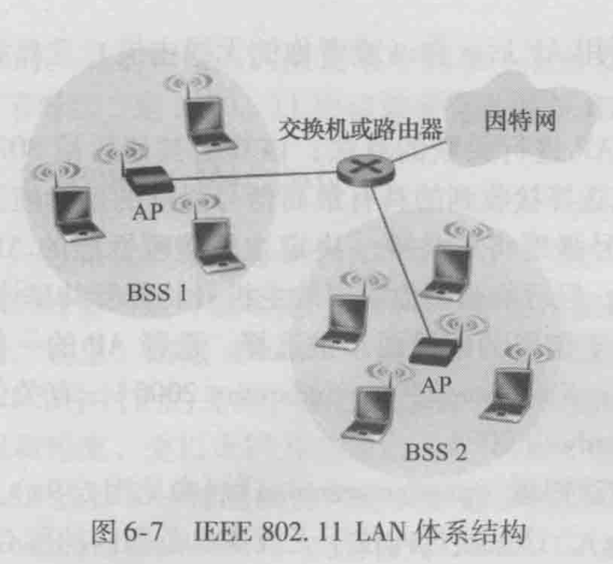

-   链路层服务：分帧，媒介访问控制(Medium Access Control, MAC）

-   主体部分是在网络适配器(network adaper)/网络接口卡(Network Interface
    Card)中实现

-   局域网

    -   局域网的构成：拓扑结构、传输媒介

    -   网桥

        -   网桥的作用和工作原理

        -   路由机制：转发表、地址学习、生成树算法、路由发现机制

    -   二三层交换机，基本工作机理

        -   比较：Bridge, hub, Layer 2 Switch, Layer 3 Switch, Router

    -   令牌环：基本工作原理

-   以太网

    -   媒体接入控制：CSMA的基本思想

        -   说话前先监听：载波侦听

        -   如果与其他人同时开始说话，停止说话：冲突检测

    -   CSMA/CD的工作原理

        -   冲突检测的方式

        -   冲突检测与传播/传输时延的关系

        -   二进制指数退避算法

            -   n次碰撞→{0,1,2,…,2\^n-1}中随机算则K值

        -   最小帧长和最大范围

    -   IEEE 802.3以太网规约

        -   以太网媒介

            -   100BASE-TX

        -   以太网帧格式

            -   前同步码：用于唤醒接受适配器并且同步时钟

                -   前7字节：10101010

                -   最后字节：10101011

            -   目的地址，源地址

            -   类型字段：IP，ARP

            -   以太网帧数据

            -   CRC：循环冗余检测

-   无线局域网

    -   无线局域网的概念和应用

    -   IEEE 802.11体系结构

        -   基本概念

        -   体系结构图

>   AP BSS I 1±16-7 BSS 2 IEEE 802. 11 LAN

-   与一个AP关联，周期性发送信标帧

-   媒体接入控制 CSMA/CA

    -   分布式协调功能

    -   点协调功能

    -   与以太网的 CSMA/CD相比较

-   802.11b/g频段及传输速率

-   网络性能分析

    -   指标：网络时延、丢包、吞吐量概念

    -   四种时延：处理、排队、传输、传播

    -   传输媒介利用率分析

        -   Point-to-point link

        -   ALOHA, Slotted ALOHA

        -   令牌环

        -   CSMA/CD（ p-persistent ）的简单性能模型
