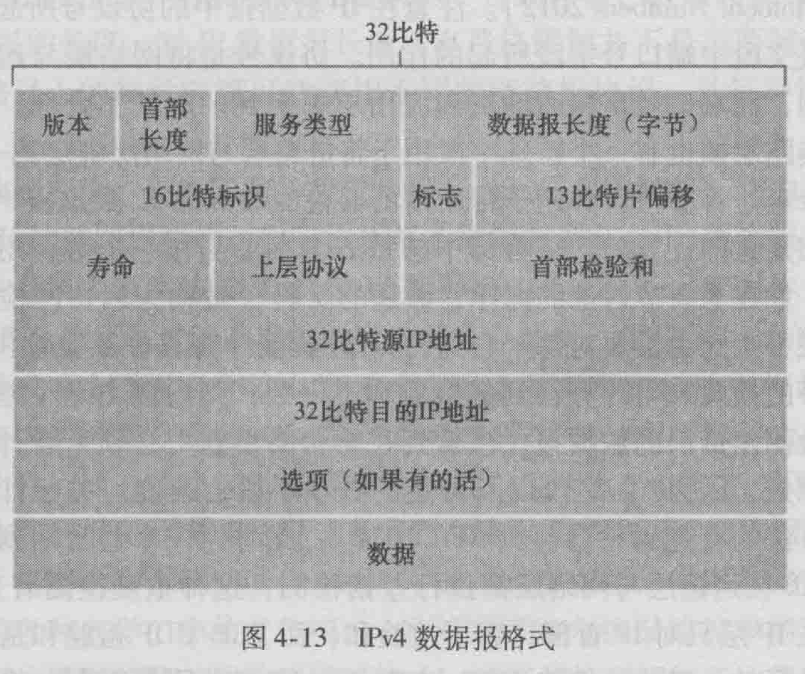
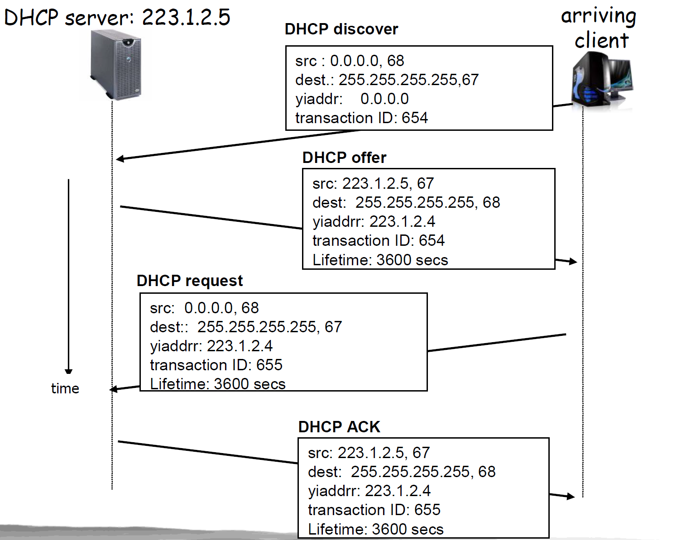

-   网络层服务：

    -   交换/路由，转发，建立连接（虚电路）

-   分组交换网络，基本思想

    -   flow of packets/singular packet

    -   对比：虚电路网络（ATM）和数据报网络（IP网络）

-   分组交换网络中路由

    -   性能评估指标

    -   路由信息的更新方式

-   路由算法

    -   集中式路由

    -   分布式路由

        -   洪泛 flooding

            -   no network info required

            -   to every neighbor

            -   a number of copies arrive

            -   缺点

                -   duplicates

                -   cycle problem

        -   随机行走 random routing

            -   no network info needed

            -   suitable for strongly-connected network

            -   typically not optimal

        -   自适应路由//动态路由策略与算法

            -   requires info about network

    -   最小代价路由算法及其性能分析

        -   Bellman-Ford（分布式、局部信息）-RIP

            -   initialization

            -   update

            -   repeat until no change made to route

            -   link cost changes:

                -   毒性逆转 poisoned reverse

                    -   在路由失效后将该失效路由一并广播

                    -   不能完全解决count to infinity
                        problem：对于3个以上节点的网络

        -   Dijkstra Algorithm（集中式、全局信息）-OSPF

            -   initialization

            -   get net node

            -   update least-cost paths

        -   第一、二、三代互联网路由算法之间的对比和改进

            -   Bellman-Ford → Dijkstra

-   链路代价的计算

    -   Link utilization

        -   $$\rho = \frac{2\left( T_{s} - T \right)}{T_{s} - 2T}$$

        -   T - current measured delay

        -   Ts - mean packet length(600bit) / transmission rate of the link

    -   Leveling

        -   $$U_{n} = \alpha*\rho_{n} + \left( 1 - \alpha \right)*U_{n - 1}$$

        -   Un - leveled link utilizaion at time n

        -   a - constant, now set 0.5

-   自治系统与路由方式

    -   IRP(IGP) 与 ERP（EGP）概念

    -   内部路由协议

        -   距离向量协议（RIP, Routing Information Protocol）

        -   链路状态协议（OSPF, Open Shortest Path First）

        -   路由结构图与路由表的生成

    -   BGP

        -   BGP的功能

        -   基本报文类型和工作方式

-   IP协议

    -   IP基本原理

        -   异构网络环境下，internet协议的工作过程

    -   协议

        -   协议基本原语与相关参数

        -   IPv4首部格式（各字段含义和变化）

>   计算机生成了可选文字: 32比特 寿命 服务类型 “．16比特标识 上层协议
>   32比特源IP地址 数据报长度次字节） 13比特片偏移 首部检验和 32比特目的IP地址
>   选项（如果有的话） 图4·13 数据， IPv4数据报格式

-   版本号：IP协议版本

-   首部长度：确定数据部分实际从哪里开始，一般为20字节

-   服务类型(TOS)：把不同类型的IP数据包区别

-   数据包长度：IP数据包的总长度

-   标识，标志，片偏移：IPv6不允许再路由器上对分组分片

-   寿命(Time-To-Live, TTL)：确保数据包不会永远循环

-   协议：指示具体的运输层协议（6：TCP，17：UDP）

-   首部校验和

-   源和目的IP地址

-   IP地址的分类法

-   A、B、C、D类划分标准和地址范围

-   子网划分/聚集

-   CIDR表达

-   IPv6

    -   和IPv4的异同，优缺点

-   NAT原理及优缺点(Network Address Translation)

    -   优点

        -   复用私网地址节约IP

        -   对外网隐藏真实IP

    -   缺点

        -   增加转发开销

        -   需要重新计算校验和

-   ARP地址解析原理和流程

    -   Sender

        -   looks into local cache first, if none

        -   constructs ARP request, insert \< sender IP, sender MAC, destination
            IP\>

        -   broadcasts using MAC frame

        -   caches destination's \<MAC, IP\> pair with timestamp

    -   Receiver

        -   checks the destination IP, if OK

        -   constructs ARP reply, insert \<destination IP, destionation MAC\>

        -   sendes to sender MAC using MAC frame

        -   caches sender's \<MAC, IP\> pair with timestamp

-   DHCP(Dynamic Host Configuration Protocal)动态地址获取的过程

>   计算机生成了可选文字: DHCPserver:223·1·2·5 DHCPdiscover src：0．0．0．0，68
>   dest.:255．255．255．25567 yiaddr:0．0．0．0 transactionID:654 DHCPoffer
>   src:223．1．2．567 dest:255．255．255．25568 yiaddrr:223．1．2．4
>   transactionID:654 Lifetime:3600secs DHCPrequest src:0．0．0．0，68
>   dest::255．255．255．255，67 yiaddrr:223．1．2．4 transactionID:655
>   Lifetime:3600secs time DHCPACK src:223．1．2．567
>   dest:255．255．255．255，68 yiaddrr:223．1．2．4 transactionID:655
>   Lifetime:3600secs arrtvtng client

-   ICMP(internet control message
    protocol)：用于发送出错信息，Ping和traceroute的实现原理

    -   Protocol type = 1

>   计算机生成了可选文字: Ethernet header header ℃MP header userdata Ethernet
>   CRC

-   Mobile IP

    -   概念：移动终端，归属代理，外部代理，隧道

        -   移动终端：可以从一个网络向另一个网络移动的终端

        -   归属代理：一个归属网络（移动节点的永久居所）中代表移动节点之下移动管理功能的实体

        -   外部代理：一个外部网络（移动节点当前所在网络）中帮助移动节点做移动管理功能的实体

    -   三角路由原理

-   IP组播

    -   组播地址

    -   组播模型

    -   组播组管理：IGMP

    -   组播路由机制（Shared-tree, Source-based tree）
